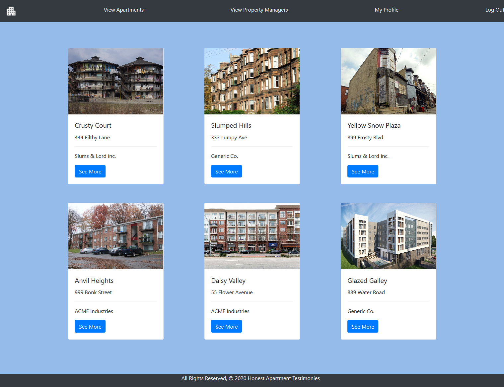

# Endless Hunger

## Description
This is a website which is meant to be used by current and former tenants to report on quality of life of the apartment building they've lived in and review the property manager's performance in relation to maintence and pest control

## Demo
https://bigmacwithbacon.herokuapp.com/

## Trello Board
https://trello.com/b/uO2eWuCF/honest-apartment-testimonies

## Homepage

## Technologies Used
  
Python, Django, PostgreSQL, Django-Environ, Psycopg2-Binary, HTML, Bootstrap, CSS, and Javascript
  

## Future Enhancements

* Adding a search bar
* Add Google Maps locations for addresses
* Add Private lists
